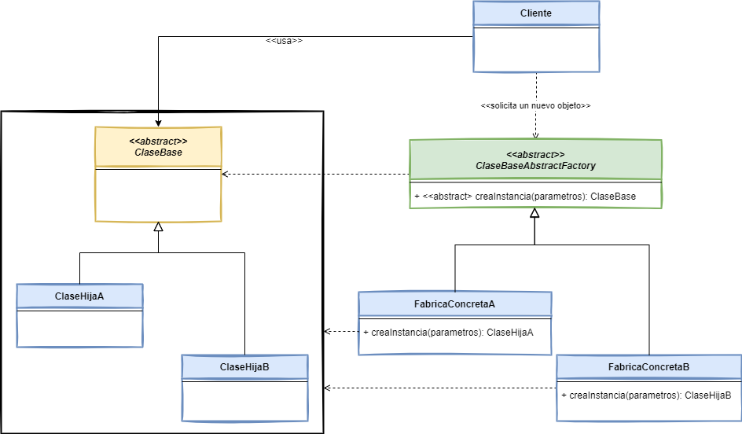

# Factory Method

## 👋 Bienvenid@s

Este repositorio contiene los ejemplos de código de la implementación del patrón de diseño [*Factory Method*](https://www.javatutoriales.com/2021/12/patron-de-diseno-factory-method.html).

Para ver el tutorial completo, con la explicación detallada del patrón, entra al Blog:
[JavaTutoriales](https://www.javatutoriales.com/2021/12/patron-de-diseno-factory-method.html)

En el tutorial explico tres diferentes estrategias de implementación del patrón, junto con una variación del mismo llamada símplemente ***Factory*** o ***Simple Factory***.

Aquí dejo un breve (muy breve) resumen del mismo.

## 🎯 Objetivo de *Factory Method*

- Crear objetos sin exponer al cliente la lógica de cómo se crean esas instancias.
- Hacer referencia al objeto de reciente creación usando una interface común.
- Definir una interface para crear objetos, pero dejar que sean las subclases quienes decidan qué clase instanciar.
 

## 📑 Diagrama

## ⚙️Requerimientos
El proyecto está desarrollado usando **Java 17** y **Gradle 7.3**, pero no uso ningúna característica particular de esta versión de Java, por lo que deberías poder ejectarlo en cualquier versión de Java.

## 💻 Explicación
Para ver el tutorial completo, con la explicación detallada del patrón, entra al Blog:
[JavaTutoriales](https://www.javatutoriales.com/2021/12/patron-de-diseno-factory-method.html)